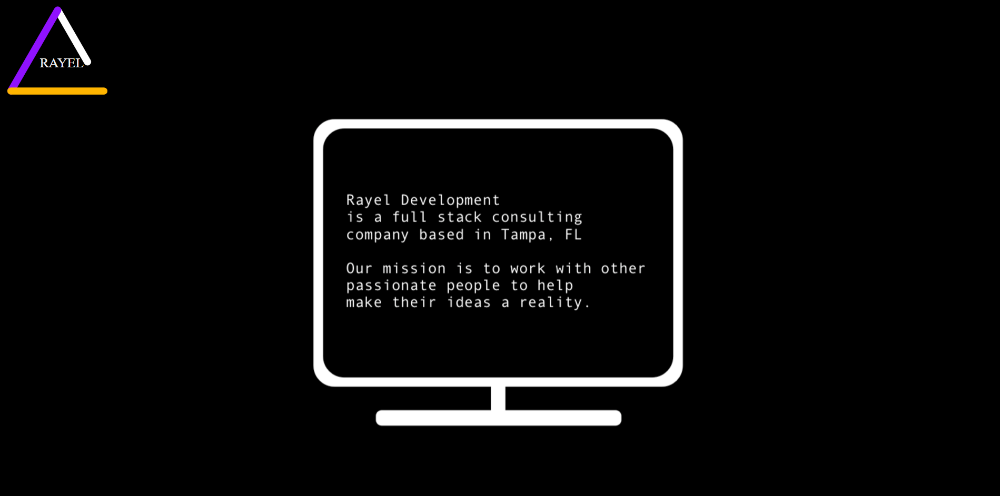
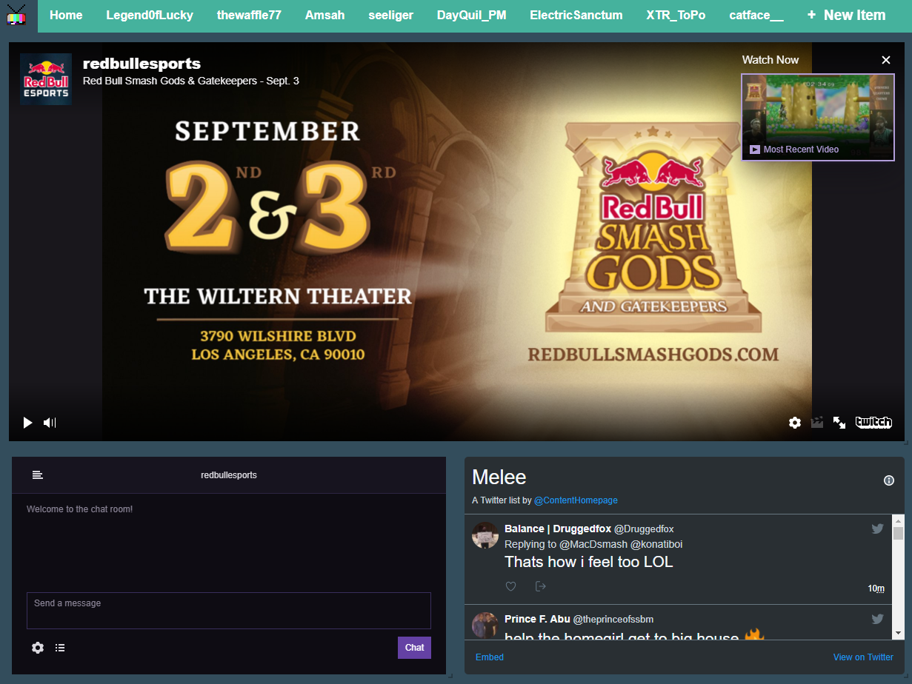

    Projects Past and Present

***

**Rayel Development**

Rayel is the company under which my business partner and I will be accepting contracts for consulting work.

***

**Messersmith Films**

The goal of this project was to do a full site rebuild using content from the old web site hosted on Squarespace with an extra bit of customization that wasn't available to the client on Squarespace.

***

**Content Homepage**

Content Homepage is a project that aims to bring many different functions across web sites onto one page.
I started this project because I like to watch livesteams but the chat is too hard to follow and it was annoying
to have to arrange windows to get Twitter and Twitch and however many other sites I wanted open.

***

**Google Calendar Reservations**

This project was a school project for a Software Engineering course. The goal of it was to create a simplified interface for users to schedule appointments using google calendar for a barbershop.

***

**Field Engineer Dashboard**

This project was created while I was working at a startup in Tampa. This was a prototype of an iPad friendly web application for field engineers to view and respond to messages, track projects and other workers, and fill out and submit any relevant forms

